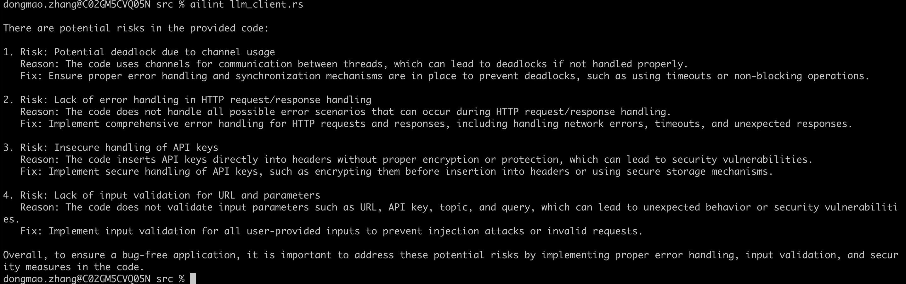
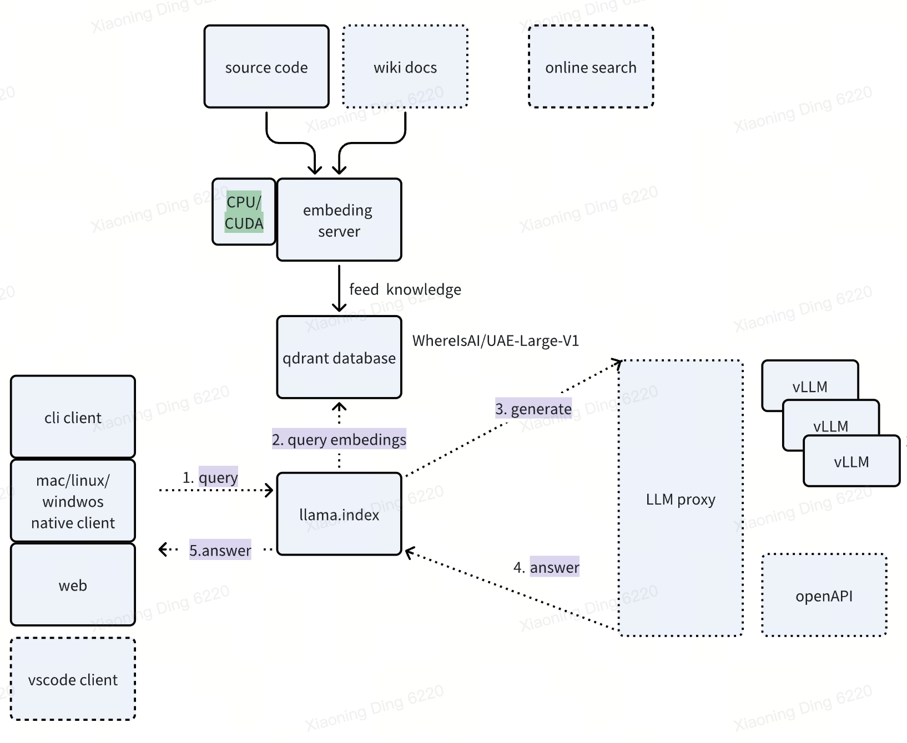

# AILint
AILint is a LLM-backed Linter. It scans a file or a git diff to identify potential code problems, and offer suggestions. 

## Installation

1. Install the binary:

```
curl -fsSL https://raw.githubusercontent.com/bd-iaas-us/AILint/main/install.sh | bash
```

2. Setup the environment variables `API_URL` and `API_KEY`.

AILint is not only a commandline tool. It relies on a backend with the power of LLM, RAG and vector storage. You can setup your own backend or use an existing backend. We will update the document soon on how to setup your own backend. Before that, just find an existing backend and set environment variables `API_URL` and `API_KEY` to point to it.


# How To Use

Just run "ailint <fileName>" to find the potential problems in your code and see the recommended fixes.

Here is an example screenshot:




# Architecture


