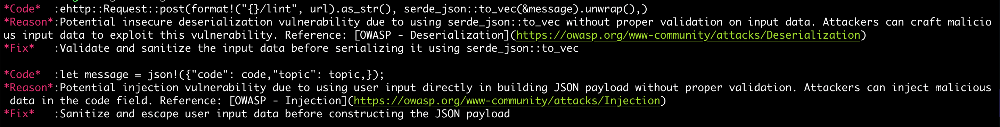
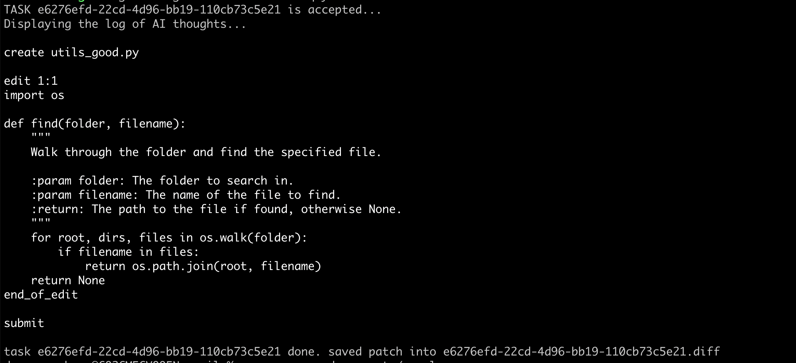

<!-- PROJECT SHIELDS -->
[![Contributors][contributors-shield]][contributors-url]
[![CI][ci-shield]][ci-url]
[![Issues][issues-shield]][issues-url]

<!-- PROJECT LOGO -->
<p align="center">
  
</p>

# AutoSE

AutoSE (Automated Software Engineering) is an AI-agent-based service that automates various software development activities. It is designed to seamlessly tackle complex software engineering tasks across different stages of the software development lifecycle, including design, coding, testing, and operation. By leveraging cutting-edge LLM and AI agent technology, AutoSE aims to provide effective solutions to these challenges.

## Features

* Lint:
  * Scan a code file or a git diff to identify potential code problems.
  * Offer suggestions and potential fixes for the problems. 
* Dev:
  * Given a github task or a local task description file, generate a local git patch for the specified task. 

## Highlights
* Rich set of actions
  * Add new actions for the LLM to understand code efficiently.
* RAG support
   * Enhance the model's ability to retrieve relevant information and generate more accurate & context-aware responses.
* Generate Infrastructure as Code - Terraform
  * Generate Infrastructure as Code (IaC) for Terraform to configure the environment based on the users' requirements and validate the syntax.

## Installation

1. Install the binary:

```
curl -fsSL https://raw.githubusercontent.com/bd-iaas-us/autoSE/main/install.sh | bash
```

2. Setup the environment variables `API_URL` and `API_KEY`.

AutoSE is not only a command-line tool. It relies on a backend with the power of LLM, RAG and vector storage. You can setup your own backend or use an existing backend. We will update the document soon on how to setup your own backend. At this time, just find an existing backend and set environment variables `API_URL` and `API_KEY` to point to it.


## How To Use

### lint

#### file mode
`autose lint <fileName>`
Scan a single code file to identify potential code problems and get suggestions.

#### diff mode
Scan a git diff to find the potential problems in your code and see the recommended fixes.

(1) single file git diff mode

`autose lint --diff-mode <fileName>`

(2) project git diff mode

If the command `autose lint --diff-mode` is executed in a git-managed directory, autoSE calls git diff to check for any potential issues in the diffs.

Here is an example screenshot:



### dev




## Run AutoSE Server
1. Install Dependencies:
Navigate to the root of the repository.

`pip install -r server/april/requirements.txt`

2. Clone the SWE-agent Repository 

`git clone https://github.com/bd-iaas-us/SWE-agent.git`

3. Create a `keys.cfg` File at the Root of the SWE-agent Repository

`OPENAI_API_KEY: 'OpenAI API Key Here if using OpenAI Model'`

4. Navigate to the Root of the SWE-agent Repository and Start the Uvicorn Server

`uvicorn --port 8000 --app-dir {your_path} api:app`

Replace {your_path} with the actual path to your application directory, for example `uvicorn --port 8000 --app-dir /root/project/autoSE/server/april api:app`.

5. Send a Sample cURL Request Request

`curl --location 'http://127.0.0.1:8000/dev' \
--header 'Authorization: xxxxxx' \
--header 'Content-Type: application/json' \
--data '{
  "repo": "https://github.com/bd-iaas-us/autoSE",
  "prompt": "add README.md",
  "model": "openai:gpt4"
}'`

## Version History
* 0.4:
  * Support Terraform generation, with the support RAG and result verification.
  * Add new actions to swe-agent 
  * Perform swe-bench test, submit the result to SWE-bench, and get a rank in the lead board.
* 0.3:
  * Generate unit tests and verify the build in a batch manner. 
  * Support RAG for swe-agent 
  * Standard test cases set or benchmark (including our own test cases).
  * A simple persistent metric/log that can show how many users and their usage.
* 0.2:
  * Fix the existing bugs in Lint and enhance its functionality.
  * Release Dev feature. 
* 0.1:
  * Initial release of Lint feature.


<!-- MARKDOWN LINKS & IMAGES -->
[contributors-shield]:https://img.shields.io/github/contributors/bd-iaas-us/autoSE.svg?style=for-the-badge&color=ADD8E6
[contributors-url]:https://github.com/bd-iaas-us/autoSE/graphs/contributors
[ci-shield]:https://img.shields.io/github/actions/workflow/status/bd-iaas-us/autoSE/ci.yml.svg?branch=main&label=CI&style=for-the-badge&color=F0E68C
[ci-url]:https://github.com/bd-iaas-us/autoSE/blob/main/.github/workflows/ci.yml
[issues-shield]:https://img.shields.io/github/issues/bd-iaas-us/autoSE.svg?style=for-the-badge&color=9370DB
[issues-url]:https://github.com/bd-iaas-us/autoSE/issues
